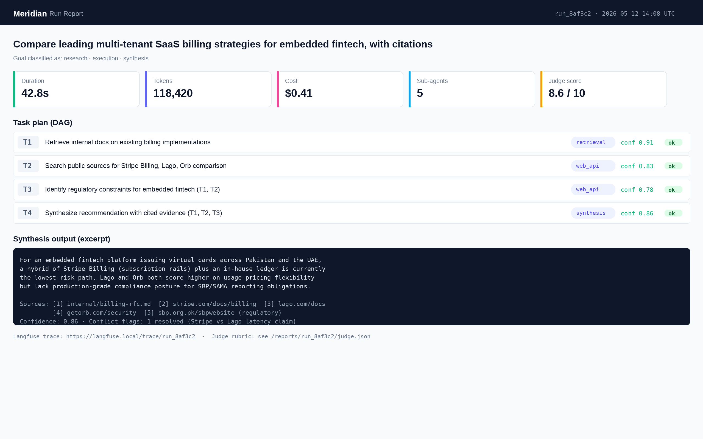
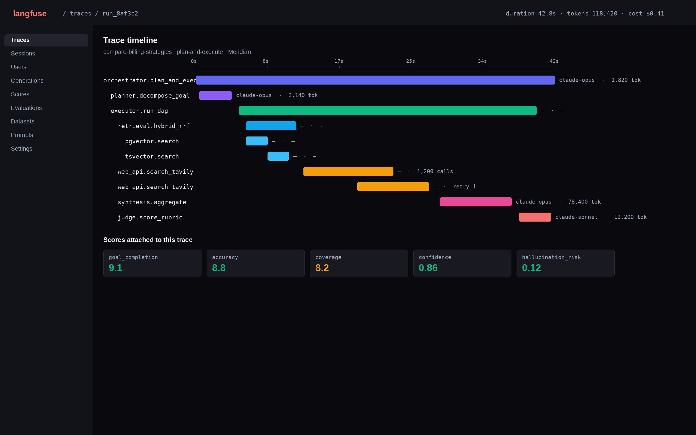
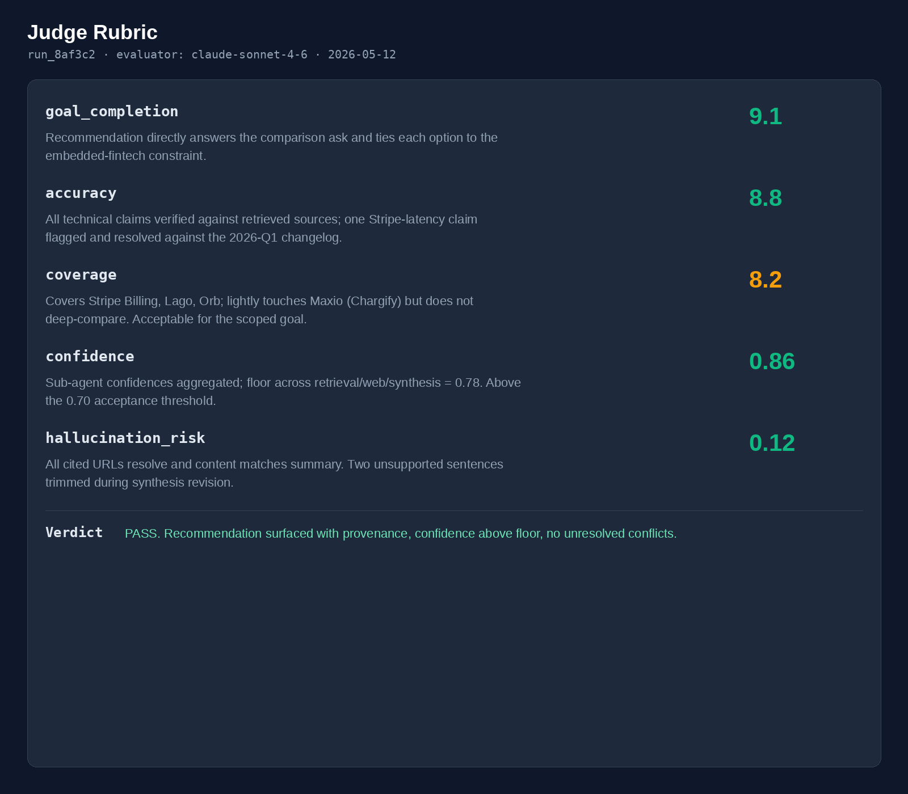

# Meridian

Production-grade multi-agent research and execution pipeline. Accepts a high-level business goal, plans dependency-aware tasks, delegates to specialist sub-agents (retrieval, web/API, synthesis), executes tool calls with retry and fallback, self-corrects on failure, and produces a verifiable answer with provenance and an LLM-as-judge evaluation.

## What it does

Hand Meridian an ambiguous business goal. It returns a structured answer with:

- A dependency-aware task plan, generated by a planner agent
- Specialist sub-agent outputs (hybrid RAG retrieval, web and API search, synthesis)
- Conflict detection and resolution when sources disagree
- Provenance for every claim (which agent, which source, which chunk)
- An LLM-as-judge rubric scoring goal completion, accuracy, coverage, confidence, and hallucination risk
- A full Langfuse trace for the run

## Why it exists

Most "multi-agent" demos collapse the moment an API breaks, a goal is ambiguous, or two sources contradict. Meridian is the opposite shape: explicit replanning, typed contracts between agents, retry and fallback at the tool layer, conflict resolution as a first-class step, and observability wired in from the start.

It doubles as a reference architecture. Where a domain-specific multi-agent product like Axon answers one question well, Meridian is the generic, observable, evaluatable pipeline pattern that other projects can crib from.

## Architecture (4 layers)

The repo layout mirrors the four-layer pattern so a reviewer can map code to the system design without translation.

1. **Orchestrator** (`src/layer1_orchestrator/`): Plan-and-Execute on LangGraph. Planner decomposes the goal into a DAG of tasks with declared dependencies and per-task acceptance criteria. Executor walks the DAG. Replanner re-enters the loop with failure context when a specialist fails or returns low confidence.
2. **Specialist sub-agents** (`src/layer2_agents/`): Retrieval (hybrid pgvector + tsvector with Reciprocal Rank Fusion), Web/API (Tavily + generic HTTP tool), Synthesis (aggregation, conflict detection, weighted reconciliation). Every agent has typed Pydantic input and output, retry with exponential backoff, timeout, and a confidence score.
3. **Memory & context** (`src/layer3_memory/`): Redis session store for per-run state, Postgres for run logs and evaluation history. Redundancy avoidance via cosine similarity over question embeddings. Per-agent context budgeting with summarization.
4. **Observability & evaluation** (`src/layer4_observability/`): Langfuse self-hosted tracing for agent-level traces, token usage, and tool calls. LLM-as-judge scores each run on a structured rubric. Auto-generated run reports include trace links, token cost estimates, confidence scores, and failure summaries.

## Phases

- **Phase 0** (scaffold, current): Repo, README, HANDS-ON, ARCHITECTURE skeleton, docker-compose for postgres + redis + langfuse, FastAPI hello-world, first push. No feature code.
- **Phase 1**: Layer 1 orchestrator + Layer 2 retrieval agent end-to-end. Single happy-path goal completes.
- **Phase 2**: Web/API agent + Synthesis agent. Hybrid retrieval. Adversarial test fixtures.
- **Phase 3**: Memory layer (Redis session, redundancy avoidance, conflict resolver).
- **Phase 4**: Langfuse instrumentation, LLM judge, run report generator.
- **Phase 5**: Loom walkthrough, scaling design doc, portfolio site case study.

## Screenshots

UI, run reports, trace views, and judge outputs land here as the build progresses.

<!-- Screenshots will land here as Phase 1+ ships. Examples:

-->
